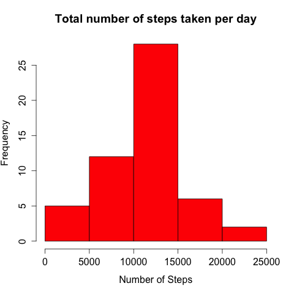
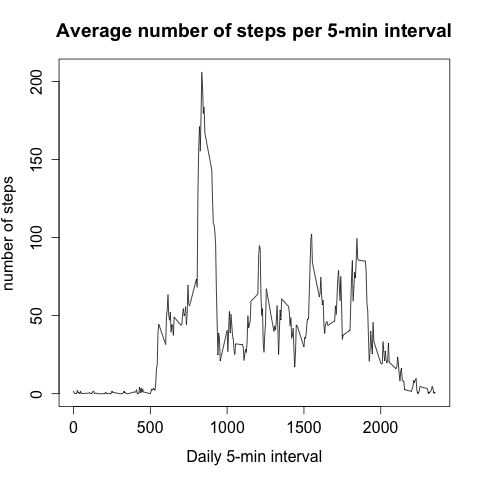
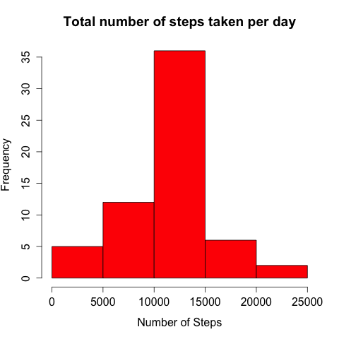
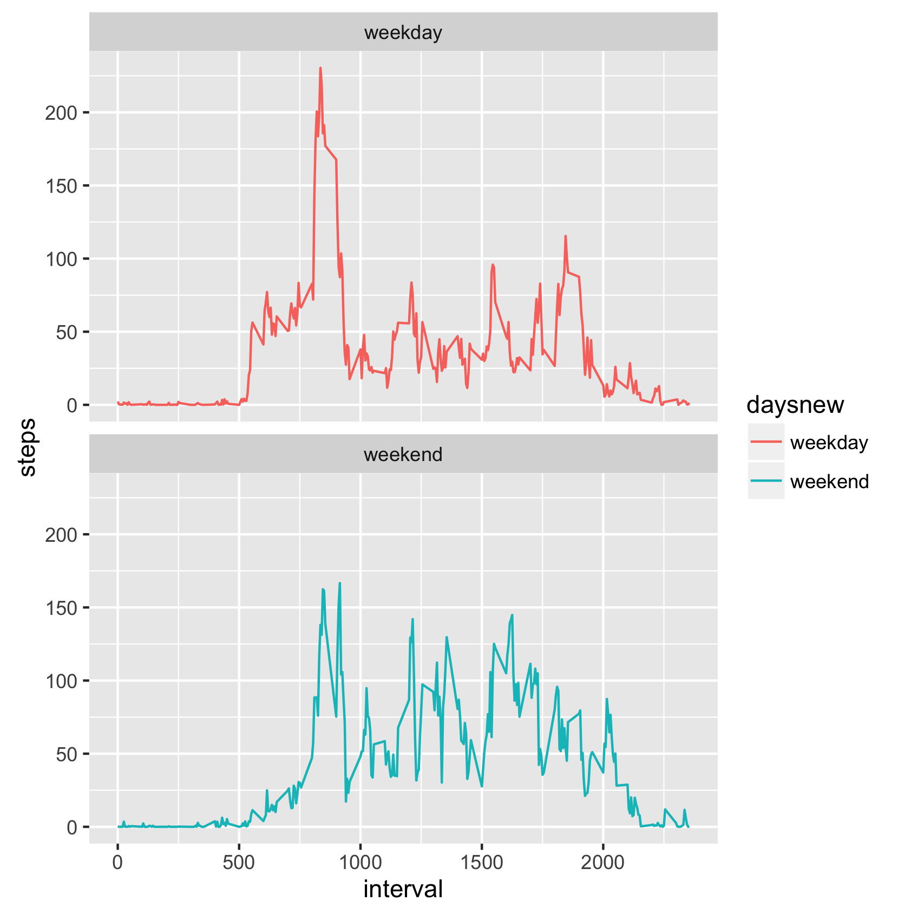

## Loading and preprocessing the data
Download the dataset into the local folder and manually unzip it. Then load the data into dataframe `activity`. After checking data type of each variable in the dataset, transform the variable `Date` to date type.

    activity <- read.csv("activity.csv")
    activity$date <- as.Date(activity$date, format = "%Y-%m-%d")

## What is mean total number of steps taken per day?
Calculate the total number of steps taken by each day `DailyTotalSteps` and create a histogram plot that is named `MeanTotalSteps.png`.

    DailyTotalSteps <- aggregate(steps ~ date, activity, sum)
    hist(DailyTotalSteps$steps, xlab = "Number of Steps", main = "Total number of steps taken per day", col = "red")

Calulate the mean and median of total number of steps taken by each day. 

    MeanTotalSteps <- mean(DailyTotalSteps$steps)
    
    MedianTotalSteps <- median(DailyTotalSteps$steps)
  

The mean `MeanTotalSteps` is 10766.19 and the median 'MedianTotalSteps' is 10765.

## What is the average daily activity pattern?
Calculate the average steps of each interval for all days. 

    MeanDailyInterval <- aggregate(steps ~ interval, activity, mean)
Create a time series plot to show the average daily activity pattern. The plot is named `MeanDailyInterval.png`.

    plot(MeanDailyInterval$interval, MeanDailyInterval$steps, type = "l", xlab = "Daily 5-min interval", ylab = "number of steps", main = "Average number of steps per 5-min interval")

Find out the 5-minute interval, on average across all the days in the dataset, contains the maximum number of steps. The maximum number of steps is 206.1698 which happens at the 5-minute inverval of 835. 

    MeanDailyInterval[which.max(MeanDailyInterval$steps),]

## Imputing missing values
In the dataset, there are 2304 out of 17568 observations of the variable `steps` missing and recorded as `NA`

    MissingRows <- sum(!complete.cases(activity))

To fill in all of the missing values in the dataset, the mean for that 5-minute interval for all days is used. For example, if steps of interval 50 on 2012-10-01 is missing, it would be replaced with 0.3018868, which is average steps of all days happened at interval 50. The new dataset with imputed missing values is called `activityXNa`.

    MeanDailyIntervalList <- as.character(MeanDailyInterval$steps)
    names(MeanDailyIntervalList) <- MeanDailyInterval$interval
    activityXNa <- activity
    naSelect <- is.na(activity$steps)
    activityXNa$steps[naSelect] <- as.numeric(MeanDailyIntervalList[as.character(activity$interval[naSelect])])
    
Create a histogram for total number of steps taken by each day using the new dataset. The plot is named `MeanTotalStepsXNa.png`.

    DailyTotalStepsXNa <- aggregate(steps ~ date, activityXNa, sum)
    hist(DailyTotalStepsXNa$steps, xlab = "Number of Steps", main = "Total number of steps taken per day", col = "red")
    

Calclate new mean `MeanTotalStepsXNa` and new median `MedianTotalStepsXNa` for the new dataset with imputed missing values. Both mean and median is 10766.19. Compared to the original dataset with missing values, the means are same but the median is higher.

    MeanTotalStepsXNa <- mean(DailyTotalStepsXNa$steps)
    MedianTotalStepsXNa <- median(DailyTotalStepsXNa$steps)
    

## Are there differences in activity patterns between weekdays and weekends?
Create a new factor varialbe in `activityXNa` dataset with two levels - "weekday" and "weekend" indicating whether a given date is a weekday or a weekend day. This new factor variable is called `daysnew`.

    activityXNa$days <- weekdays(activityXNa$date)
    weekendSelect <- activityXNa$days == 'Sunday' | activityXNa$days == 'Saturday'
    weekdaySelect <- activityXNa$days == 'Monday' | activityXNa$days == 'Tuesday' | activityXNa$days == 'Wednesday' | activityXNa$days == 'Thursday' | activityXNa$days == 'Friday'
    activityXNa$days[weekendSelect] <- 'weekend'
    activityXNa$days[weekdaySelect] <- 'weekday'
    daysnew <- as.factor(activityXNa$days)

Create a panel plot containing compareing average numbers of steps of each 5-minute invertal between weekdays and weekend days. The plot is called `MeanDailyInterval2.png`. It is very obvious that a higher peak happens earlier on weekdays and people are generally more active on weekends.

    MeanDailyInterval2 <- aggregate(steps ~ interval+daysnew, activityXNa, mean)
    MeanDailyInterval2
    library(ggplot2)
    z <-ggplot(MeanDailyInterval2, aes(x = interval, y = steps, color = daysnew)) + geom_line() + facet_wrap(~daysnew, ncol = 1, nrow = 2)
    print(z)

